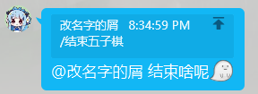

# Saladim.QBot docs

## 消息构建和消息处理

### 消息构建

一般地, 我们提供了`SendMessageAsync(string rawString)`这个函数给绝大部分的`IMessageWindow`实现类, 通过这个函数我们可以使用格式化编码后的一段字符串来发送消息实体, 在`GoCqHttp`中, 它是以CQ码进行编码的

CQ码的一般形式是:
```
[CQ:at,qq=2748166392]
[CQ:poke]
[CQ:forward,flag=43qF34fqf23gfFds]
[CQ:image,url=http://127.0.0.1:5702]
```
以`[CQ:`开头, 然后描述该CQ码的类别, CQ码的类别有很多, 常用的有`at`@,`poke`戳一戳,`forward`消息组合转发,`image`图片,`record`录音音频等. 在类别描述完之后, 如果类别还不能完全描述这个非文本节点时, 后面会尾随一系列以逗号分隔的参数, 比如`at`节点就需要一个`qq`的参数描述对应用户qq号, 参数的格式为`name=value`形的键值对, 在参数描述完之后, 以`]`符号关闭. 同样的, 在参数的值中含有特殊字符`[],&`时会被进行转义. 转义方式与我们在之前章节讨论的转义是一致的.

幸运的是我们不需要自己去构建一个消息构建器去组装这个复杂的字符串, 在`GoCqHttp`实现中我们提供了`MessageEntityBuilder`, 事实上实现`SaladimQBot.Core.IClient`的时候你也同时必须实现`CreateMessageBuilder()`. 一般可通过一下几个方式实例化一个`builder`:
```cs
//直接使用构造器
var mb = new MessageEntityBuilder(client);
//使用Client提供的方法
var mb = client.CreateMessageBuilder();
```
获取到构建器后我们就可以开始组装这个消息了, 这里我们以如下的消息为例:
```
[CQ:reply,id=-858996454][CQ:at,qq=2748166392] 这是什么[CQ:face,id=32]
```
这个消息在qq中看起来是这个样子的():



假设这条被回复的消息id是-858996454, 变量`msgBeReplied`储存了这条消息的引用, `2748166392`是这条消息@的人的id

> 其中幽灵表情的id是`187`

> 在前面我们可能说了构建一个带@的消息需要一个实体, 在这里实际上这是框架早期的要求, 现在的`WithAt`拥有多个重载, 包含实体,id等作为参数.

现在我们来构建它:
```cs
var builder = client.CreateMessageBuilder();
var msgEntity = builder.WithReply(msgBeReplied);
                       .WithAt(2748166392)
                       .WithText(" ")
                       .WithText("结束啥呢")
                       .WithFace(187)
                       .Build();
```
接下来你就可以使用`msgEntity`来发送这个消息了

一般我们会常用以下几个添加节点的方法:
- `WithText` 添加一段文字
- `WithTextLine` 添加一段文字并加入换行
- `WithImage` 添加一副图片, 其中参数为图片url(发送本地图片见本文章末尾的描述)
- `WithAt` 添加一个@实体, 其中通常有以下几种重载:
  - `WithAt(long userId)` 使用qq号, 在对方不在群内时忽略
  - `WithAt(long userId, string nameWhenUserNotExists)` 使用qq号, 同时在对方不在群时昵称使用第二个参数代替
  - `WithAt(User user)` 使用用户实体
  - `WithAt(User user, string nameWhenUserNotExists)` 同第二条, 但使用用户实体
- `WithFace` 添加一个qq表情, 参数为表情id, 你可以在[这里](https://github.com/richardchien/coolq-http-api/wiki/%E8%A1%A8%E6%83%85-CQ-%E7%A0%81-ID-%E8%A1%A8)找到映射表
- `WithReply` 添加消息回复, 不推荐将回复节点放入非第一位, 参数1为要回复的消息
  
有时候我们可能会像快速回复一个消息但是内容只有纯文本, 所以我们为client提供了一个拓展的方法:
```cs
client.CreateMessageBuilder(Message msgToReply);
```
通过这个方法你可以快速拿到包含回复该消息的消息构建器, 在未来我们将会加入更多让我们使用更便捷的大量的拓展方法和重载方法. 也十分欢迎你来贡献这虽然微不足道但很powerful的小拓展方法.

所有理论可支持的节点可以在[这里](https://docs.go-cqhttp.org/cqcode/#qq-%E8%A1%A8%E6%83%85)找到. 其中未在本框架中实现的节点目前暂时不可用. 
~~在计划中的未来我们会加入自定义节点的支持, 以使得间接支持go-cqhttp中的所有cq码.~~ 截止`v0.4.1-alpha`目前已支持`WithUnImpl`方法加入自定义节点, 其中该方法接受一个节点名称和参数字典.

### 消息构建-额外

~~你可能了解到`image`或`record`等节点需要一个在线的url指向这个资源, 这可能意味着不能很方便的使用本地文件发送, 目前你可以使用本地开启http服务器的方式来提供, 在未来我们会以依赖注入中的服务的形式来提供这个完善的http服务器支持, 在此之前你可以参考[这个wpf管理台项目的Http服务](https://github.com/saladim-org/Saladim.QBot/blob/96ed7ead7ae75bc2c1e1ac7ee96d65fd99cc8e4b/SaladimWpf/Services/HttpServerService.cs)源码~~

2022.12.23纠正上述的错误: 并不需要一个指向互联网的url, 你可以使用如: "file:///C:\your\files\here.png" 的格式发送本体图片, 这是`uri`的本地文件规则, 注意路径务必使用完整路径, 你可以使用`System.IO.Path.GetFullPath`这个方法获取完整路径, 然后在其之前拼接`"file:///"`字符串.

### 消息发送

大部分情况下我们使用实现了消息窗口的实体就足够了, 比如我们现在拥有一个`FriendUser`类型的`friendUser`实例, 我们可以这样向其发送好友消息:
```c#
await friendUser.SendMessageAsync("你好这是纯文本");
await friendUser.SendMessageAsync(
    client.CreateMessageBuilder(msg)
          .WithFace(18)
          .WithTextLine("qwq")
          .WithImage("https://somedomain.com/yourImageFilePathHere")
          .Build()
    );
```
如果拥有一个`GroupMessage`类型的`groupMsg`实例, 我们可以这样回复/向群里发送消息:
```cs
groupMsg.Group.SendMessageAsync("hi, just directly send to group")
groupMsg.ReplyAsync("just replied the message with only text")
```
当群聊发送者是好友时你可以使用这种方式向其发送好友消息:
```cs
var sender = client.GetFriendUser(groupMsg.Sender.UserId);
sender.SendMessageAsync("qwq, 你是我的好友哎");
```
目前正在计划向`User`类加入`AsFriendUser`方法中, 以及判别用户是否是好友

最后修改: 2023-1-6 21:33:41